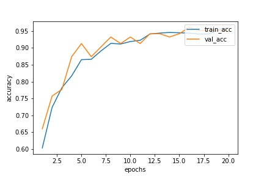
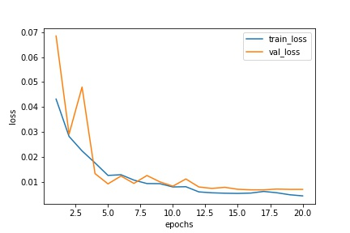

## Fine-Grained bird species classification

### Challenge
[Here](https://www.kaggle.com/c/mva-recvis-2020/leaderboard) is the kaggle challenge. The dataset can be downloaded from [here](https://www.kaggle.com/c/mva-recvis-2020/data).
My final rank on the Leadearboard was 49 out of 167 participants, with a test accuracy score of 0.84254

### Code

#### Install dependencies

```bash
pip install -r requirements.txt
```

#### Reshuffle and crop images
Reshuffle the train and valid images. The number of images per class are kept the same.
```bash
python shuffle_train_valid.py ----data-shuffled <folder-directory>
```

Detect and crop bird images with fasterRCNN. Specify ```--data-crop``` where to save the cropped images.
You can overwrite the original images by the specifying the folder containing the original images.
```bash
python crop.py --data-crop <folder-directory>
```

#### Train
Train the model. As the model trains, model checkpoints are saved to files such as `model_x.pth` to the current working directory.
Specify ```--data-crop``` where data is located.
```bash
python main.py --data <folder-directory>
```
When training is finished, accuracy and loss are plotted and saved.
The following plots are obtained when training with resnext101.
<p float="left">
  
   
</p>


#### Test


Choose one of the checkpoints and run:

```
python evaluate.py --data <data-directory> --model <model-file>
```

This generates a file `kaggle.csv` that can be uploaded to the private kaggle competition website. After the upload,
a test accuracy score is computed. 


